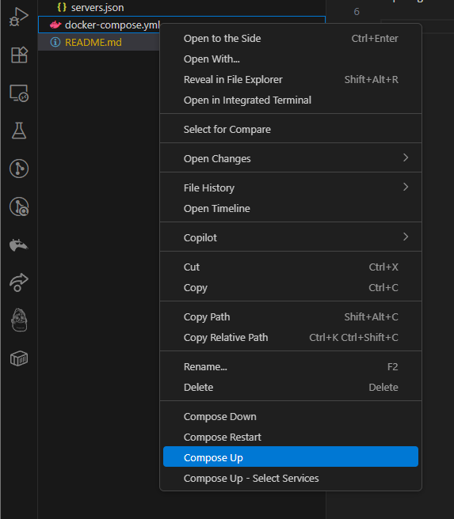
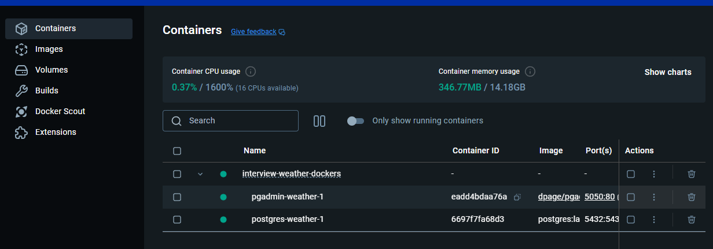
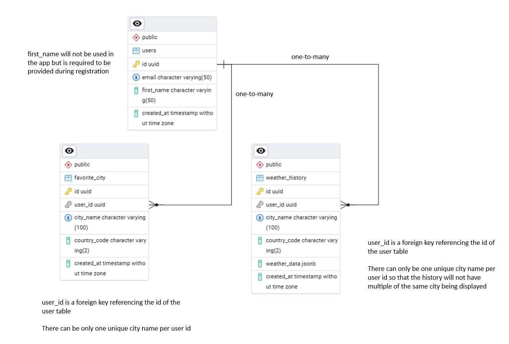

# Interview Weather Dockers

Run `docker compose -f 'docker-compose.yml' up -d --build` or use VS Code Docker extension to start this docker container.

A postgres DB should be started and the required tables will be created if everything is executed properly

One PgAdmin and Postgres DB should be running

DB Schema

